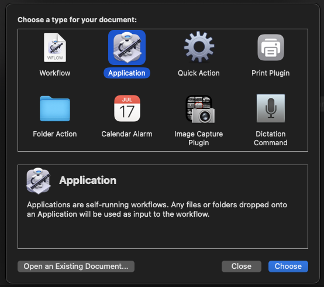
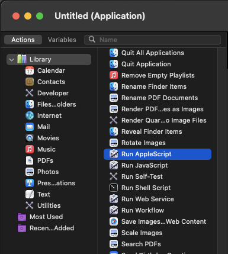

# youtubeDownloader program to download YouTube videos and converting them to an .mp3 file, have fun!

# SETUP:
Just create an .env file in the current working directory with the following variables:
- DESIRED_FOLDER_PATH
- MEDIA_FOLDER

Now run the python script and paste the URL of the video. The program will do the rest.

PRO TIP: create an executable application to run this script on your system.

>>> MacOS

1. Open Script Editor app, which can be found under the Applications folder

2. Paste the following into the editor:

    tell application "Terminal"
	    do script with command "python /Users/*YOURPATH*/ytDownloader.py"
    end tell

3. Go to File -> Export

4. On "Where:" I would suggest putting the application into the Applications folder so that you can see it in your Launchpad

5. On "File Format:" , choose Application instead of Script, hit save.

6. Double click your new application to run the automation

7. Enjoy!

Using Automator app:

1. Open Automator app, which can be found under the Applications folder

2. Create a new application like so:

3. Paste the following commands into the editor:

	on run {input, parameters}
	
		tell application "Terminal"
	    	do script with command "python /Users/*YOURPATH*/ytDownloader.py"
		end tell
	
		return input
	end run

4. Save the app in the Applications folder

7. Go to Launchpad, find the app and click it to run the automation

8. Enjoy!

>>> Windows

1. Sell it and buy a Mac, lol just kidding... will update the steps here soon.

- Fau was here -